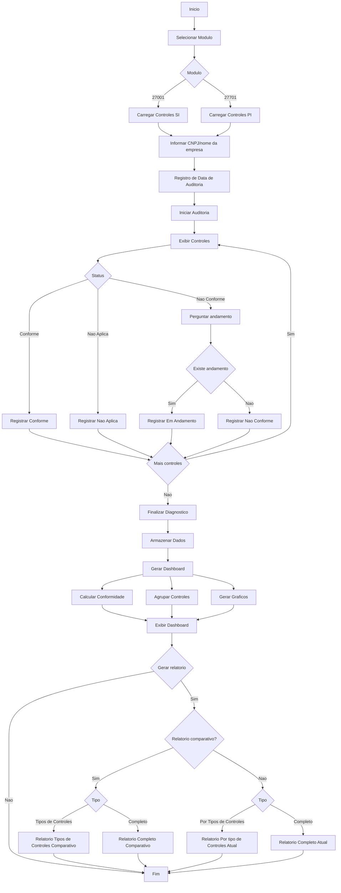

# Projeto de Segurança I (PSI) 12 a 25 de maio
Com os conceitos apreendidos os alunos **(em até 3 pessoas)** precisam desenvolver uma ferramenta que auxilie no diagnóstico da conoformidade (conforme, não conforme ou não aplica). As apresentações de PSI deverão ser feitas nos dias **25 e 26 de maio**. 
- _O que o seu sistema deve ter?_
    - Um módulo para 27001 e outro para 27701.
    - Utilizar 27002 para diagnóstico da conformidade de 27001.
    - Perguntar nome da empresa
    - Para cada controle, perguntar se está conforme ou não está conforme ou não se aplica. Caso não esteja conforme, perguntar se existe alguma trabalho em andamento.
    - Apresentar os dados no formato de dashboard:
      - Agrupar os dados por tipos de controle (27002)
      - Apresentar gráficos de conformidade agrupado por tipos de controles (parciais) e total.
    - Armazenar os dados e data de auditoria para efeitos comparativos (3 últimas auditorias).
    - Fazer UML da ferramenta.
    - Apresentar relatórios por tipos de controle ou relatório completo de conformidade.
--- 
## Artefatos esperados do PSI

1. Descrição do sistema
2. Diagramas utilizados
    - classe
    - caso
    - UML
3. Dashboard de conformidade
    - % geral de conformidade
    - % por tipo de controle
    - gráficos (pizza ou barra)
4. Funcionalidade de comparativo
    - comparar com as auditorias anteriores
    - mostrar evolução de conformidade
5. Relatórios (somente após a conclusão de auditoria)
    - por tipos de controles
    - completo
    - opções:
        - comparativos
        - atual
---
## Fluxograma para PSI (sugestão)
> Diagrama propositalmente não acentuado

---
  

---